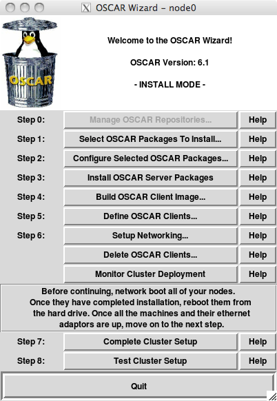
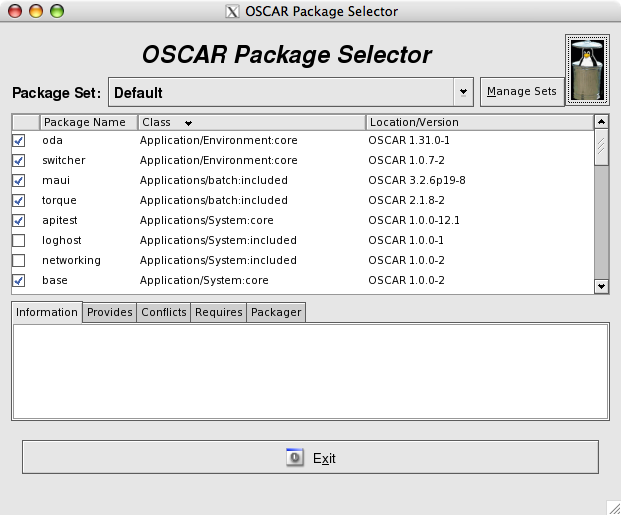
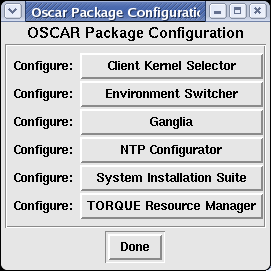
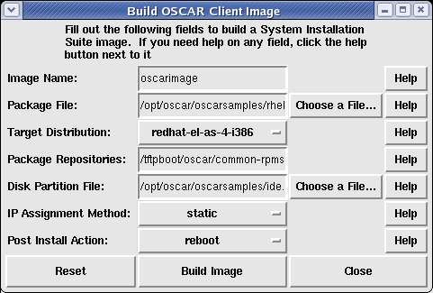
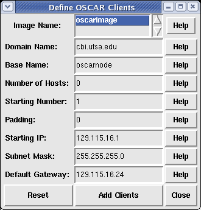
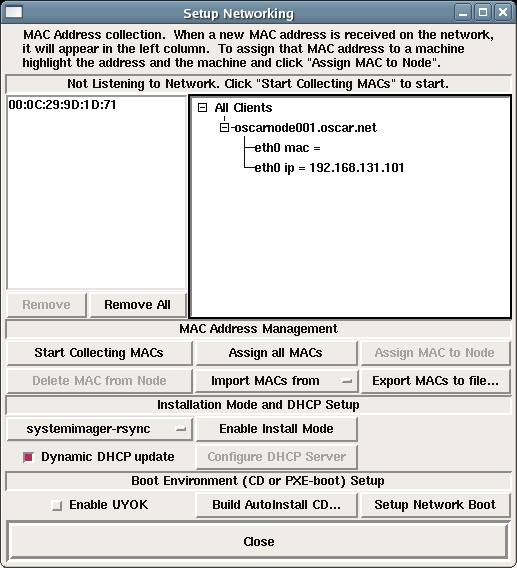
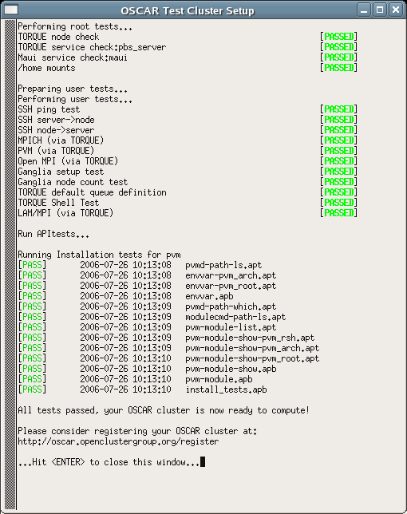

<!-- Name: InstallGuideClusterInstall -->
<!-- Version: 22 -->
<!-- Author: olahaye74 -->

[[TOC]]

[back to Table of Contents](InstallGuideDoc)

# Chapter 5: Detailed Cluster Installation Procedure

## <a name='wizard'></a>5.1 Launching the OSCAR Installer

Change directory to the top-level OSCAR directory and start the OSCAR install wizard.  If you placed the source in the location suggested in the earlier example, the commands to start the installer would be:

1. Execute as root *oscar-config --bootstrap*
1. Execute as root *oscar_wizard install*

The *oscar-config --bootstrap* command will execute some setup / configuration steps, including (but not limited to):

 * installs prerequisite packages on the server,
 * installs all OSCAR server binary packages,
 * updates _/etc/hosts_ with OSCAR aliases,
 * updates _/etc/exports_,
 * start/restarts system services needed by OSCAR.

A lot of output will be displayed in the console window where you invoked oscar_wizard. This reflects normal operational output from the various installation commands that OSCAR executes. The output is also saved in the file  _/var/log/oscar/oscar_wizard.log_ for later reference (particularly if something goes wrong during during the installation).

The wizard, as shown in Figure 1, is provided to guide you through the rest of the cluster installation. To use the wizard, you will complete a series of steps, with each step being initiated by the pressing of a button on the wizard. Do not go on to the next step until the instructions say to do so, as there are times when you may need to complete an action outside of the wizard before continuing on with the next step. For each step, there is also a <Help> button located directly to the right of the step button. When pressed, the <Help> button displays a message box describing the purpose of the step.

*Figure 1: OSCAR Wizard.*



In brief, the functions of the various buttons is as follows:

 * *Step 0: Manage OSCAR Repositories* [disabled]
   * This step is currently disabled but it will be available in a future release.
 * *Step 1: Select OSCAR Packages To Install*
   * This step allows the selection of non-core OSCAR Packages to be installed. Typically these are resource manager/scheduling systems, parallel programming libraries as well as other tools that aid in cluster administration. Certain packages may conflict with each other and only allow either one of them to be installed (eg. SGE vs TORQUE/Maui). 
 * *Step 2: Configure Selected OSCAR Packages* [optional]
   * Certain packages have configuration options that can be set prior to installation, these settings can be set during this step. 
 * *Step 3: Install OSCAR Server Packages*
   * This step would install all the selected packages (in Step 1) on the server (headnode) - this step is repeatable. 
 * *Step 4: Build OSCAR Client Image*
   * This step allows the user to build an OS image using SystemInstaller. This image will then be pushed to the compute nodes as part of cluster installation. 
 * *Step 5: Define OSCAR Clients*
   * After image(s) are created, clients to be part of your cluster needs to be defined. The user can select hostnames for your compute nodes, number of nodes, etc. 
 * *Step 6: Setup Networking*
   * This step allows the user to tie MAC addresses to defined clients (in the previous step) such that when they boot up, they will automatically be imaged. Installation mode is also set in this step - currently available modes are: systemimager-rsync (default), systemimager-multicast, systemimager-bt. After this mode is set, the user should then configure DHCP Server and also select Setup Network Boot. 
 * *Delete OSCAR Clients* [hopefully unneccesary]
   * This button allows the user to delete OSCAR clients from the cluster. Services will be stopped on the nodes to be deleted and restarted on all the remaining nodes. The cluster will be re-configured without the presence of the deleted node entries in ODA. 
 * *Monitor Cluster Deployment* [optional]
   * This step brings up the SystemImager monitoring widget si_monitortk which provides very useful information regarding image progress. The user can also invoke the Virtual Console by double-clicking on a node and this will bring up a window with console messages during the installation. 
 * *Step 7: Complete Cluster Setup*
   * Perform this step after all your cluster nodes have successfully been imaged and rebooted. This step will initiate post-cluster installation fix-ups and get it ready for production. 
 * *Step 8: Test Cluster Setup* [optional]
   * OSCAR provides some tests for its packages and this step invokes all these testing harness to ensure that your cluster is setup properly and ready for production runs. 

## <a name='downloadOpkg'></a>5.2 Manage OSCAR Repositories

_Note:_ This step is disabled and it will be available in a future release.


## <a name='selectOpkg'></a>5.3 Selecting Packages to Install

If you wish to change the list of packages that are installed, click on the ```<Select OSCAR Packages To Install>``` button. This step is optional – by default all packages directly included in OSCAR are selected and installed. However, if you downloaded any additional packages, e.g., via OPD/OPDer, they will not be selected for installation by default. Therefore you will need to click this button and select the appropriate OSCAR Packages to install on the cluster. When you click on the button, a window similar to the one shown in Figure 3 appears. Each of the packages that the OSCAR installer has found are listed in the main frame. Core packages must be installed and cannot be unselected. Included packages can be unselected if desired.

*Figure 3: OSCAR package selection.*



Note that this window only shows OSCAR packages -- it does not show individual RPMs. Once you have a selected a set of OSCAR packages to install, click on the <Exit> button to save your selections and return to the main OSCAR window. Note that closing the window yields the same result and there is no way of ‘defaulting’ to the original settings, so make sure your package list is complete before proceeding to the next step.

## <a name='configOpkg'></a>5.4 Configuring OSCAR Packages

_Note:_ This step is optional.

Some OSCAR packages allow themselves to be configured. Clicking on the<Configure Selected OSCAR Packages> button will bring up a window listing all the packages that can be configured. Figure 3 shows a sample with only the Environment Switcher package listed. Clicking on any of the packages’ <Config> button will bring up a panel for configuring that package. Select whatever options are appropriate for that package, and then click on the <Save> button to save your selections, or the <Cancel> button to cancel all of your selections and leave the original settings. If you have saved your changes but want to go back to the default settings, simply click on the <Default Configuration> button and then the <Save> button to revert to the original settings.

*Figure 4: OSCAR package configuration.*



This step is optional. If you do not click on the <Configure Selected OSCAR Packages> button, defaults for all packages will be used.

### 5.4.1 Selecting a Default MPI Implementation

Although multiple MPI implementations can be installed, only one can be "active" for each user at a time. Specifically, each user’s path needs to be set to refer to a "default" MPI that will be used for all commands. The Environment Switcher package provides a convenient mechanism for switching between multiple MPI implementations. Section 6.13 contains more details about this package (page 40).

The Environment Switcher package is mentioned now, however, because its configuration panel allows you to select which MPI implementation will be the initial "default" for all users. OSCAR currently includes two MPI implementations: LAM/MPI and MPICH. Using Environment Switcher’s configuration panel, you can select one of these two to be the cluster’s default MPI.

You can change this default setting later -- see Section 6.13 for more details.

When you close the main Configuration window, the following benign warning may appear in the shell window (it is safe to ignore):

    Tag "mpi" does not seem to exist yet. Skipping.

## <a name='serverPackages'></a>5.5 Install OSCAR Server Packages

This is the first required step of the OSCAR installation.

Press the <Install OSCAR Server Packages> button. This will invoke the installation of various RPMs and auxiliary configuration on the server node. Execution may take several minutes; text output and status messages will appear in the shell window.

A popup will appear indicating the success or failure of this step. Click on the <Close> button to dismiss it.

## <a name='buildImage'></a>5.6 Build OSCAR Client Image

Before pressing the <Build OSCAR Client Image>, ensure that the following conditions on the server are true:

 * Ensure that the SSH daemon’s configuration file (`/etc/ssh/sshd config`) on the headnode has PermitRootLogin set to yes. After the OSCAR installation, you may set this back to no (if you want), but it needs to be yes during the install because the config file is copied to the client nodes, and root must be able to login to the client nodes remotely.
 * By the same token, ensure that TCP wrappers settings are not "too tight". The `/etc/hosts.allow` and `/etc/hosts.deny` files should allow all traffic from the entire private subnet.
 * Also, beware of firewall software that restricts traffic in the private subnet.  SELinux should also be deactivated on the head node.

If these conditions are not met, the installation may fail during this step or later steps with unhelpful messages. 

Press the <Build OSCAR Client Image> button. A dialog will be displayed. In most cases, the defaults will be sufficient. You should verify that the disk partition file is the proper type for your client nodes. The sample files have the disk type as the last part of the filename. You may also want to change the post installation action and the IP assignment methods. It is important to note that if you wish to use automatic reboot, you should make sure the BIOS on each client is set to boot from the local hard drive before attempting a network boot by default. If you have to change the boot order to do a network boot before a disk boot to install your client machines, you should not use automatic reboot.

Building the image may take several minutes; _compared to previous OSCAR releases, there is progression bar_' (since we use online repository it is difficult to exactly know the current progression of the image creation). To follow the progression, one may follow the output in the console window during the build. It is normal to see some warning messages in the console. You can safely ignore these messages and wait for the final popup window announcing the success or failure of the overall image build.

A sample dialog is shown in Figure 4.

*Figure 4: Build the image.*



Customizing your image::
  The defaults of this panel use the sample disk partition and RPM package files that can be found in the _oscarsamples_ directory. You may want to customize these files to make the image suit your particular requirements.

Disk partitioning::
  The disk partition file contains a line for each partition desired, where each line is in the following format:

```
<partition> <size in megabytes> <type> <mount point> <options>
```
      
Here is a sample (for a SCSI disk):
```
/dev/sda1 24 ext3 /boot defaults
/dev/sda5 128 swap
/dev/sda6 * ext3 / defaults
nfs_oscar:/home - nfs /home rw
```
      
An * in the size column causes that partition to grow to fill the entire disk. You can create your own partition files, but make sure that you do not exceed the physical capacity of your client hardware. Also be careful to not specify duplicate filesystems as this will cause problems during the installation. The sample listed above, and some others, are in the ''oscarsamples'' directory.
      
The disk partition file is auto-selected based on the type of disk(s) available on your headnode.  However, SystemImager has the functionality where it can deploy images and be agnostic with the target client's disks, whether they are ''hda'', ''sda'', or other.  In other words, even if you built your image with ''ide.disk'', you can deploy the image to clients with SCSI/SATA hard disks and vice versa.
    
Package lists::

  The package list is simply a list of RPM file names (one per line). Be sure to include all prerequisites that any packages you might add. You do not need to specify the version, architecture, or extension of the RPM filename. For example, bash-2.05-8.i386.rpm need only be listed as "bash".
    
Build the Image::

  Once you are satisfied with the input, click the <Build Image> button. When the image completes, a popup window will appear indicating whether the build succeeded or failed. If successful, click the <Close> button to close the popup, and then press the <Close> button on the build image window. You will be back at the main OSCAR wizard menu.
      
If the build fails, look through the console output for some indication as to what happened to cause the failure. Common causes include: prerequisite failure, ran out of disk space, and missing package files. Also see the Release Notes for this version of OSCAR in Chapter 3.
    
## <a name='defineClients'></a>5.7 Define OSCAR Clients
    
Press the ```<Define OSCAR Clients>``` button. In the dialog box that is displayed, enter the appropriate information. Although the defaults will be sufficient for most cases, you will need to enter a value in the Number of Hosts field to specify how many clients you want to create.
    
   1. The Image Name field should specify the image name that was used to create the image in the previous step.
   1. The Domain Name field should be used to specify the client’s IP domain name. It should contain the server node’s domain (if it has one); if the server does not have a domain name, the default name oscardomain will be put in the field (although you may change it). This field must have a value -- it cannot be blank. Note that especially for compute nodes on a private network, the domain name does not necessarily matter much. The domain name supplied in this field is used to form the fullyqualified name of each host in the OSCAR cluster. For example: oscarnode1.oscardomain, oscarnode2.oscardomain, etc. If your compute nodes are on a public network, you may want to use the "real" domain name that is part of their fully-qualified domain names.
   1. The Base name field is used to specify the first part of the client name and hostname. It will have an index appended to the end of it. This name cannot contain an underscore character "_" or a period ".".
   1. The Number of Hosts field specifies how many clients to create. This number must be greater than 0.
   1. The Starting Number specifies the index to append to the Base Name to derive the first client name. It will be incremented for each subsequent client.
   1. The Padding specifies the number of digits to pad the client names, e.g., 3 digits would yield oscarnode001. The default is 0 to have no padding between base name and number (index).
   1. The Starting IP specifies the IP address of the first client. It will be incremented for each subsequent client. See Footnote 3 on page 20 for more information on how to pick a starting IP address. Clients will be given IP addresses starting with this IP address, and incrementing by 1 for each successive client. Ensure that the range of [starting ip, (starting ip+num clients)] does not conflict with the IP addresses of any other nodes on your network.
   1. The Subnet Mask specifies the IP netmask for all clients. See Footnote 4 on page 20 for more information on how to select a netmask for your cluster.
   1. The Default Gateway specifies the default route for all clients.
    
IMPORTANT NOTE::
  Be sure that the resulting range of IP addresses does not include typical broadcast addresses such as X.Y.Z.255! If you have more hosts than will fit in a single address range, see the note at the end of this section about how to make multiple IP address ranges.
    
When finished entering information, press the <Addclients> button. When those clients have been created in the database, a popup will appear indicating the completion status. A sample dialog is shown in Figure 5.
    
*Figure 5: Define the Clients.*


    
Note that this step can be executed multiple times. The GUI panel that is presented has limited flexibility in IP address numbering -- the starting IP address will only increment the least significant byte by one for each successive client. Hence, if you need to define more than 254 clients (beware of broadcast addresses!), you will need to run this step multiple times and change the starting IP address. There is no need to close the panel and return to the main OSCAR menu before executing it again; simply edit the information and click on the <Addclients> button as many times as is required.
    
Additionally, you can run this step multiple times to use more structured IP addressing schemes. With a larger cluster, for example, it may be desirable to assign IP addresses based on the top-level switch that they are connected to. For example, the 32 clients connected to switch 1 should have an address of the form 192.168.1.x. The next 32 clients will be connected to switch 2, and should therefore have an address of the form 192.168.2.x. And so on.
    
After all clients have been created, you may press the <Close> button in the build clients dialogue and continue with the next step.
    
## <a name='networking'></a>5.8 Setup Networking
    
The MAC address of a client is a twelve hex-digit hardware address embedded in the client’s ethernet adapter. For example, "00:0A:CC:01:02:03", as opposed to the familiar format of IP addresses. These MAC addresses uniquely identify client machines on a network before they are assigned IP addresses. DHCP uses the MAC address to assign IP addresses to the clients.
    
In order to collect the MAC addresses, press the <Setup Networking> button. The OSCAR network utility dialog box will be displayed. A sample dialog is shown in Figure 6.
    
*Figure 6: Collect client MAC addresses.*
    

    
To use this tool, you will need to know how to network boot your client nodes, or have a file that lists all the MACs from your cluster. For instructions on doing network booting, see Appendix A.
    
### 5.8.1 Collect Client Node MAC Addresses
    
If you need to collect the MACs in your cluster, start the collection by pressing the <Collect MAC Address> button and then network boot the first client. As the clients boot up, their MAC addresses will show up in the left hand window. You have multiple options for assigning MACs to nodes. You can either:
    
   * manually select MAC address and the appropriate client in the right side window. Click <Assign MAC to Node> to associate that MAC address with that node.
   * click <Assign all MACs> button to assign all the MACs in the left hand window to all the open nodes in the right hand window.
    
Some notes that are relevant to collecting MAC addresses from the network:
   
   * The <Dynamic DHCP Update> checkbox at the bottom right of the window controls refreshing the DHCP server. If it is selected (the default), the DHCP server configuration will be refreshed each time a MAC is assigned to a node. Note that if the DHCP reconfiguration takes place quick enough, you may not need to reboot the nodes a second time (i.e., if the DHCP server answers the request quick enough, the node may start downloading its image immediately). If this option is off, you will need to click the <Configure DHCP Server> (at least once) to give it the associations between MACs and IP addresses.
   * To remove extraneous MAC addresses from the left hand window (e.g., if the collector finds MACs that are not part of your cluster), select the address and click on the <Remove> button. Or click on the <Remove All> button to remove all of them.
   * At any time, you may click on the <Export MACs to file...> button to save the MAC address list to a file. If you need to re-run the OSCAR installation, you can later click on <Import MACs from file...> to import this file rather than re-collecting all the MACs.
   * When you have collected all of the MAC addresses, click the <Stop Collecting MACs> button.
    
If you do not have <Dynamic DHCP update> selected, you need to click the <Configure DHCP Server> button to configure the DHCP server.
    
### 5.8.2 Select Installation Mode
    
[http://www.systemimager.org SystemImager] is the tool that OSCAR uses for deploying images to cluster nodes.  It is part of a bigger suite of tools called the System Installation Suite (thus the package name in OSCAR is SIS).
    
SystemImager is responsible for deploying the OS image to your compute nodes over the network.  It supports (as of version 3.7.3) three different transports: ''systemimager-rsync'' (default), ''systemimager-multicast'' (flamethrower), and ''systemimager-bt'' (bittorrent).
    
By default, systemimager uses a program called rsync to push files to your client nodes.  To use one of these other installation modes click on the pull down list which by default displays "systemimager-rsync" and choose one of the other options.  Then click the "Enable Install Mode" button to configure the server to use that method to install images on the client nodes. Especially with the multicast option, please make sure your router supports your desired transport method.
    
In case you cannot get your nodes to image using one of these optional install modes and want to switch back to using rsync, simply go back to the <Setup Networking> menu, select <systemimager-rsync> from the pull down list, and click on <Enable Install Mode>.
    
### 5.8.3 Setup Boot Environment
    
This menu also allows you to choose your remote boot method.
    
You '''must''' do one of two things in order for your client nodes to be able to get images from the master node:
    
   * The <Build Autoinstall CD> button will build an iso image for a bootable CD and gives a simple example for using the cdrecord utility to burn the CD. This option is useful for client nodes that do not support PXE booting. In a terminal, execute the command cdrecord -scanbus to list the drives cdrecord is aware of and their dev number. Use this trio of numbers in place of dev=1,0,0 when you execute the command cdrecord -v speed=2 dev=1,0,0 /tmp/oscar bootcd.iso.
   * The <Setup Network Boot> button will configure the server to answer PXE boot requests if your client hardware supports it. See Appendix A for more details.
    
### 5.8.4 Use Your Own Kernel (UYOK)
    
SystemImager ships with its own kernel and ramdisk (initrd.img) used for starting up a minimal system for imaging your nodes.  Although the SystemImager developers try their best to keep this kernel up-to-date with new hardware modules support, this is not always possible.  Therefore, starting in version 3.6.x, a new functionality called UseYourOwnKernel (UYOK) was introduced.
    
Let's say that you have installed a Linux distribution that supports your hardware on the server, UYOK allows you to take the running kernel (from the Linux distribution) and uses that as the SystemImager boot kernel.  This, combined with a ramdisk generated on the fly from an architecture specific ''initrd_template'' package (eg. ''systemimager-i386initrd_template'') allows the user to be able to boot and image a node as long as the target OS to be deployed supports the hardware.
    
If you had to install any custom kernel modules to get your hardware to work after installing the operating system, or if you have trouble getting your nodes to boot after trying the stock systemimager kernel, click "Enable UYOK" button in the "Setup Networking" step and then either select "Build AutoInstall CD..." or "Setup Network Boot".  Then SystemImager will configure itself to use the kernel running on the head node.
    
#### Manual Setup for UYOK
    
If for some reason you wish to set up the UYOK functionality by hand, instead of using the wizard, please do the following.  This should not be neccesary if the hardware of your client nodes and head node are sufficiently similar.
    
First use UYOK to generate a kernel/ramdisk pair, execute the following command on the headnode:
    ```
    # si_prepareclient --server servername --no-rsyncd
    ```

If you specify the `--no-rsyncd` argument, it will not restart `rsyncd`.

The resulting kernel and ramdisk will be stored in `/etc/systemimager/boot`.  Now copy these files to `/tftpboot` if you are PXE-booting.  Make sure to edit your `/tftpboot/pxelinux.cfg/default` file with a sufficiently large `ramdisk_size` in the kernel append statement, eg.:
    ```
    LABEL systemimager
    KERNEL kernel
    APPEND vga=extended initrd=initrd.img root=/dev/ram MONITOR_SERVER=192.168.0.2 MONITOR_CONSOLE=yes ramdisk_size=80000
    ```
Now SystemImager will use the UYOK boot package (which should recognize your hardware) to boot your nodes and successfully image them.

## <a name='monitorDeployment'></a>5.9 Monitor Cluster Deployment

_Note:_ This step is optional.

During the client installation phase it is possible to click on the <Monitor Cluster Deployment> button to bring up the SystemImager monitor GUI. This window will display real-time status of nodes as they request images from the server machine and track their progress as they install.

## <a name='clientInstall'></a>5.10 Client Installations

During this phase, you will boot your client nodes and they will automatically be installed and configured. For a detailed explanation of what happens during client installation, see Appendix B.

The recommended method to perform client installations is via network boot.  This is the most convenient way if the network interface cards on your client nodes support PXE-boot.  If the network cards do not support PXE-boot, you can check the Etherboot Project [http://www.etherboot.org] to see if you can generate a boot-ROM for your card.  Once you have generated a boot floppy, you can use that to network boot your nodes.

If your client nodes do not have a floppy drive, or you cannot generate a working ROM, then it is still possible to boot your client nodes with an autoinstallation CD.  Please refer to the documentation on the "Setup Networking" step for information on how to generate this CD.

If the network cards that come with your client nodes support PXE, then change the BIOS settings such that "Network" is always first in boot order.  This ensures that your nodes always boot via the network and thus allows the Network Boot Manager to manage the boot order via software.  Note that this tool may not work with etherboot generated ROMs.

Once your client nodes complete installation, its next boot action will be automatically changed to "LocalBoot" meaning it will boot from hard disk.  If for whatever reason this does not work, you can manually change this via the netbootmgr widget.

This widget is available via the OSCAR Wizard in Manage mode, or via the command line as "netbootmgr".

### 5.10.1 Network boot the client nodes

See Appendix A for instructions on network booting clients.

Network boot all of your clients. As each machine boots, it will automatically start downloading and installing the OSCAR image from the server node.

### 5.10.2 Check completion status of nodes

After several minutes, the clients should complete the installation. You can use the <Monitor Cluster Deployment> functionality to monitor the progress. Depending on the Post Installation Action you selected when building the image, the clients will either halt, reboot, or beep incessantly when the installation is completed.

If you chose "reboot" as the post-install action for your nodes, you will be notified when the nodes are rebooted via the <Monitor Cluster Deployment> widget.  The node entry will turn green and the "Progress" field will say "REBOOTED".

The time required for installation depends on the capabilities of your server, your clients, your network, and the number of simultaneous client installations. Generally, it should complete within several minutes.

### 5.10.3 Reboot the client nodes

After confirming that a client has completed its installation, you should reboot the node from its hard drive. If you chose to have your clients reboot after installation (the default), they will do this on their own. If the clients are not set to reboot, you must manually reboot them. The filesystems will have been unmounted so it is safe to simply reset or power cycle them.

Note: If the network cards that come with your client nodes do not support PXE, or has etherboot generated ROMs, you may need to reset the boot order in the BIOS to boot from the local disk.

## <a name='completeSetup'></a>5.11 Complete the Cluster Setup

Ensure that all client nodes have fully booted before proceeding with this step.

Press the <Complete Cluster Setup> button. This will run the final installation configurations scripts from each OSCAR software package, and perform various cleanup and re-initialization functions. This step can be repeated should networking problems or other types of errors prevent it from being successful the first time.

A popup window will indicate the success or failure of this step. Press the <Close> button to dismiss it.

## <a name='testSetup'></a>5.12 Test Cluster Setup

A simplistic test suite is provided in OSCAR to ensure that the key cluster components (OpenSSH, TORQUE, MPI, PVM, etc.) are functioning properly.

Press the <Test Cluster Setup> button. This will open a separate window to run the tests in. The cluster’s basic services are checked and then a set of root and user level tests are run.

A sample dialog is shown in Figure 8. If any of the test fail, then there may be problem with your installation.

*Figure 8: Testing your cluster setup*



If all the tests pass, then your OSCAR cluster is ready to use.  Congratulations!

## <a name='startingOver'></a>5.13 Starting Over

If you feel that you want to start the cluster installation process over from scratch in order to recover from irresolvable errors, you can do so with the start over capability via the *oscar-config* script (the _oscar-config --startover_' command).
This command will not remove oscar-core packages. For that, you need to remove the oscar package (all deps will be removed as well).
 1. On yum based distro (rhel, fedore flavors): sudo yum -y remove oscar
 1. On urpmi based distro (Mandriva flavors): sudo urpme oscar
 1. On zypper based distro: (SuSE flavors): sudo zypper rm oscar
 1. On apt based distro: (Debian flavors): sudo apt-get remove oscar (not yet supported)

It is important to note that start over is not an uninstaller. That is, start over does not guarantee to return the head node to the state that it was in before OSCAR was installed. Especially all edited config files that have been backed up as .osckarbak files are not restored. (but you can do that manualy from the oscarbak files)

The start_over script will try to delete all packages installed by OSCAR and drop the OSCAR database.  It will also try to delete the packages which depend on the OSCAR binary packages.

Another important fact to note before starting a new OSCAR installation after using the startover capability is that, because of the environment manipulation that was performed via switcher from the previous OSCAR install, it is necessary to re-install OSCAR from a shell that was not tainted by the previous OSCAR installation. Specifically, the startover capability can remove most files and packages that were installed by OSCAR, but it cannot chase down and patch up any currently-running user environments that were tainted by the OSCAR environment manipulation packages.

Ensuring to have an untainted environment can be done in one of two ways:
 1. After starting over, completely logout and log back in again before re-installing. Simply launching a new shell may not be sufficient (e.g., if the parent environment was tainted by the previous OSCAR install). This will completely erase the previous OSCAR installation’s effect on the environment in all user shells, and establish a set of new, untainted user environments.
 1. Use a shell that was established before the previous OSCAR installation was established. Although perhaps not entirely intuitive, this may include the shell was that initially used to install the previous OSCAR installation.

Note that the logout/login method is strongly encouraged, as it may be difficult to otherwise absolutely guarantee that a given shell/window has an untainted environment.

## <a name='deletingClients'></a>5.14 Deleting Clients

If for some reason you need to delete a node from the cluster durring installation, perhaps due to mistakes while adding the client nodes or assigning a MAC address to the wrong node, you simply need to click on the "Delete OSCAR Clients" button on the OSCAR wizard main menu.  Then when the sub menu appears, select the problematic nodes from the list and click delete.  Multiple nodes can be deleted by selecting multiple names from the list.

### Deleting node images

It is also sometimes useful to be able to delete one or more of the node images which OSCAR uses to provision the client nodes or to change which image is sent to a node when it joins the cluster.

To delete an OSCAR image, you need to first unassign the image from the client(s) which are currently using that image and then run the command _mksiimage_.

There is currently no way to change which image is assigned to a node from within the OSCAR GUI, so first you will need to delete the client node(s) if you wish to change which image is used on a particular node.  It is not neccesary if the image simply changes, this procedure is only neccesary to completely change a node to use a different image entirely.  To do so, invoke the OSCAR Wizard and select "Delete OSCAR Clients...".

_mksiimage_ is a command from SystemInstaller which is used to manage SIS images on the headnode (image server).

Assuming the name of your image is _oscarimage_, here are the steps you need to do to fully delete an OSCAR image.

First delete the client(s) associated with the image, then execute:

    # mksiimage --delete --name oscarimage

If this command does not work for some reason, you can also use the command _si_rmimage_ to delete the image, just pass it the name of the image as argument.

_si_rmimage_ is a command from SystemImager, the system OSCAR uses to deploy images to the compute nodes.  SystemImager images are typically stored in `/var/lib/systemimager/images`.

Note: If you want to use the _si_rmimage_ command, execute the following commands to delete all data:

    # si_rmimage oscarimage -force

## 5.14 Reimaging the Cluster

Often in the process of setting up an OSCAR cluster for the first time, or on new hardware, it is neccesary to re-image the cluster.  Starting with OSCAR 5.x OSCAR uses the netboot manager to maintain a database of cluster states.  Initially all nodes are marked for "Installation" but after it has been imaged successfully the state is marked so that if it is network booted it will boot from the local hard drive.  This is a handy feature which allows system administrators to simply leave the cluster nodes set to network boot all the time, which saves a lot of time fiddling around with the BIOS.  However this means that if you network boot your cluster again and expect it to reimage itself as it had previously, you will be disappointed.

In order to reimage your cluster it is a simple mater of loading up the net boot manager from your closeset xterm with the "netbootmgr" cmd or loading up the management interface described in the OSCAR administration guide.  For full details about how the netbootmgr interface works, please refer to the administration guide.

To reimage your cluster, click on the "All" button under the "Selection" menu.  Then under the "Next Boot Action" pulldown select "Install" and click on the "Set" button.  That should reset the cluster nodes listed at the left hand pane to all say "Install" as their next boot action.  
